<h1 align="center">
  <a href="#">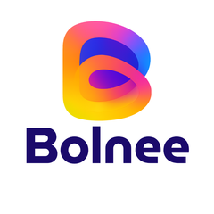</a> Bolnee-Chat
</h1>

<p align="center">
  <strong>Chatbot integration in your business website. Self hosted, free forever!</strong>
</p>

<p align="center">
  <a href="https://github.com/AniketWathore/bolnee-chat"></a>
  <a href="LICENSE"></a>
  <a href="https://github.com/AniketWathore/bolnee-chat/releases"></a>
  
  
</p>

<p align="center">
  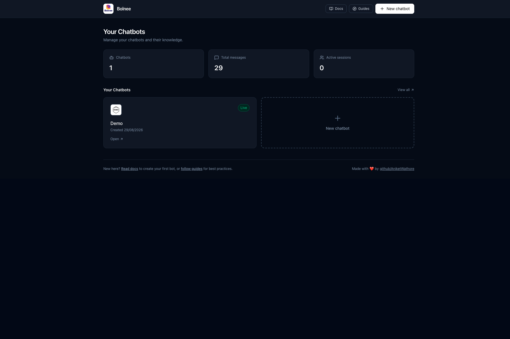
</p>

Bolnee-Chat is a self-hosted RAG chatbot platform. Create a bot, add your website + PDFs as knowledge, pick any OpenAI-compatible provider (OpenRouter, OpenAI, Groq, Ollama, vLLM), and embed a 2-line snippet. Answers are grounded in your sources with citations, visitor chats are grouped and exportable, and everything runs on your infrastructure with SQLite.

---

## Why Bolnee-Chat?

<table>
<tr>
<td width="33%" align="center" valign="top">

### Self-Hosted & Free Forever

No vendor lock-in, no per-message billing. Run on your server, Vercel or Cloudflare Pages — SQLite, no external DB.

</td>
<td width="33%" align="center" valign="top">

### RAG-Grounded Answers

Crawls your site + ingests PDFs/TXT/MD/DOCX, chunks to SQLite FTS and builds grounded prompts. Sources are cited, fallback is configurable.

</td>
<td width="33%" align="center" valign="top">

### 2-Line Embed, Any Stack

Copy `window.BotConfig` + `chatbot-widget.js` and paste before `</body>`. Works on any site, accent/theme/greeting live via dashboard.

</td>
</tr>
</table>

---

## All Features

<table>
<tr>
<td width="50%" valign="middle">

### Bot Overview — Stats & Snippet

Per-bot: `Live` status, message/user counts, creation date, source count, embed snippet with `botName/avatar/chatUrl/accent/greeting/theme`.

</td>
<td width="50%">
  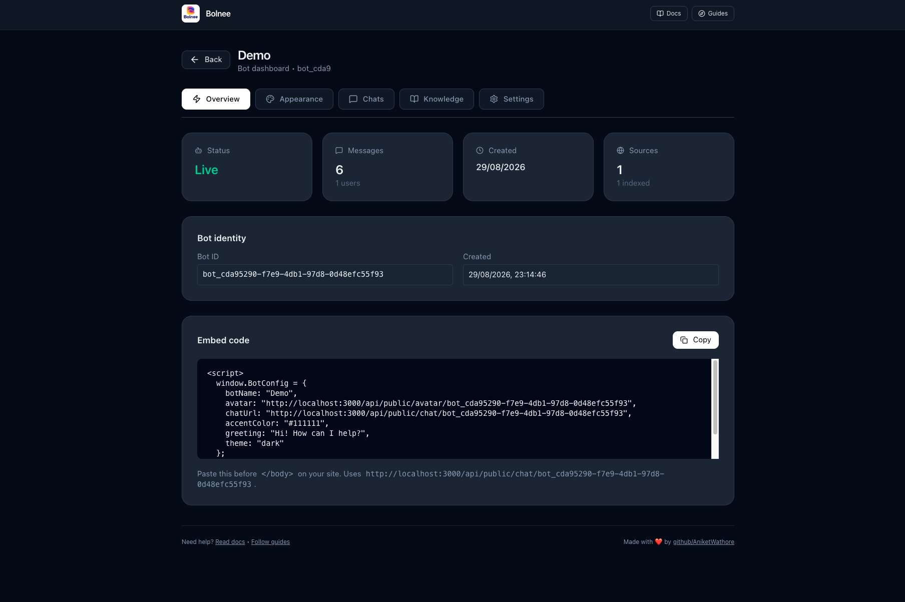
</td>
</tr>
<tr>
<td width="50%" valign="middle">

### Appearance — Live Preview

Edit bot name, avatar (upload/preview), accent/background colour, theme `light/dark/auto`, greeting. Live preview; saved via `PATCH /api/chatbots/:id`.

</td>
<td width="50%">
  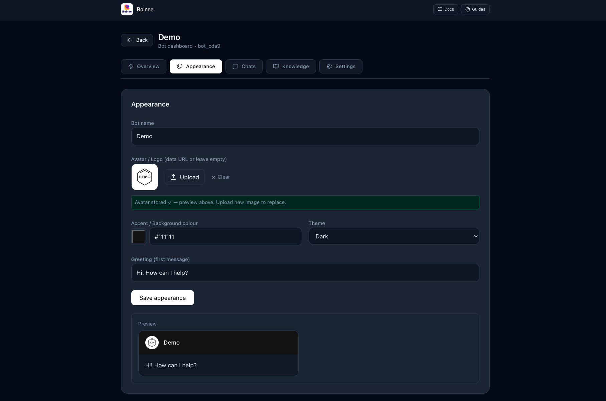
</td>
</tr>
<tr>
<td width="50%" valign="middle">

### Chats — Grouped by Visitor

Grouped by `visitorId` → `IP`, then by date, chronological. Refresh + download **CSV (Excel)** / **JSON** / **PDF** (print). Active sessions = distinct visitors last 5m.

</td>
<td width="50%">
  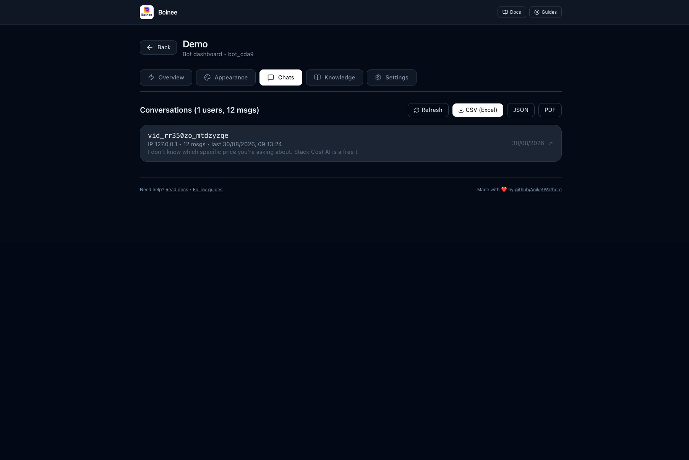
</td>
</tr>
<tr>
<td width="50%" valign="middle">

### Settings — Provider, Prompts, Danger Zone

`provider/model/baseUrl/apiKey`, default message (pre-first-turn), fallback message (no sources matched), delete bot + chats + sources + chunks.

</td>
<td width="50%">
  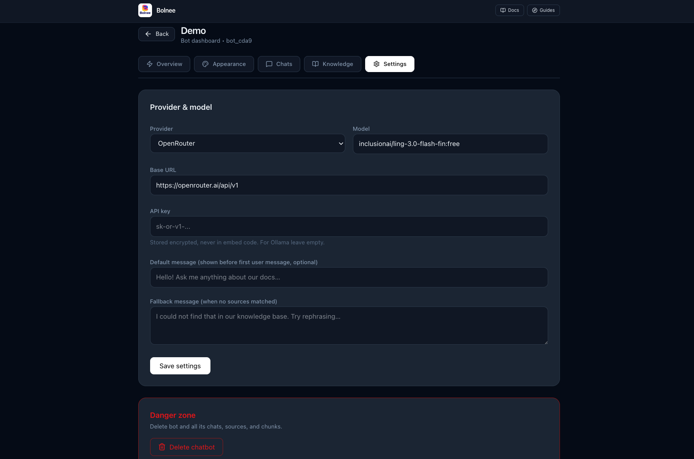
</td>
</tr>
<tr>
<td width="50%" valign="middle">

### Widget — Floating, Theme-Aware, Persistent

Bottom-right bubble → sliding window (`360×520`, `75vh` mobile). Header with accent + avatar, typing dots, SSE streaming, sources cited, `VISITOR_ID` + history in `localStorage` so greeting shows once and chats survive close/open. Theme `light/dark/auto` (`#0f172a` / `#fff`).

</td>
<td width="50%">
  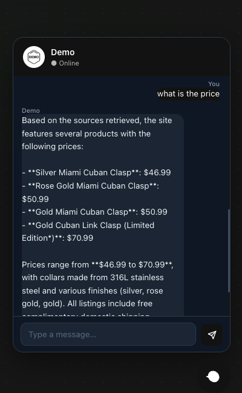
</td>
</tr>
</table>

**Also in the box:**

- **Knowledge management** — lists `locator · type · status · error · date` with delete; append more via **Add knowledge**.
- **Avatar file storage** — data URLs converted to `/api/public/avatar/:id` (2MB limit, `data/avatars/`).
- **Encrypted provider keys** — per-bot `apiKey/baseUrl/model` via AES-256-GCM, never exposed in snippet.
- **Dark-mode console** — `#020617` bg, `#1e293b` cards, `slate-800` inputs, no white surfaces.

---

## Workflow

<table>
<tr>
<td width="50%" valign="middle">

### 1. Create Chatbot — Brand in Seconds

Name + avatar (PNG/JPG/WEBP ≤2MB, preview) → stored as `/api/public/avatar/:id` and shown in the widget header.

</td>
<td width="50%">
  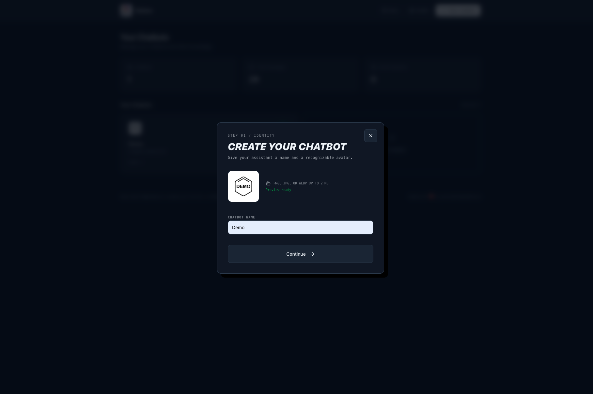
</td>
</tr>
<tr>
<td width="50%" valign="middle">

### 2. Add Knowledge — Website + Files

URL-only, files-only, or both. Same-origin crawler (`crawler/crawler.py`) respects `robots.txt`, extracts `h1/h2/p/li`, dedups, saves `data/{chatbotId}_website.json`. Status: `queued → crawling → parsing → indexing → indexed`.

</td>
<td width="50%">
  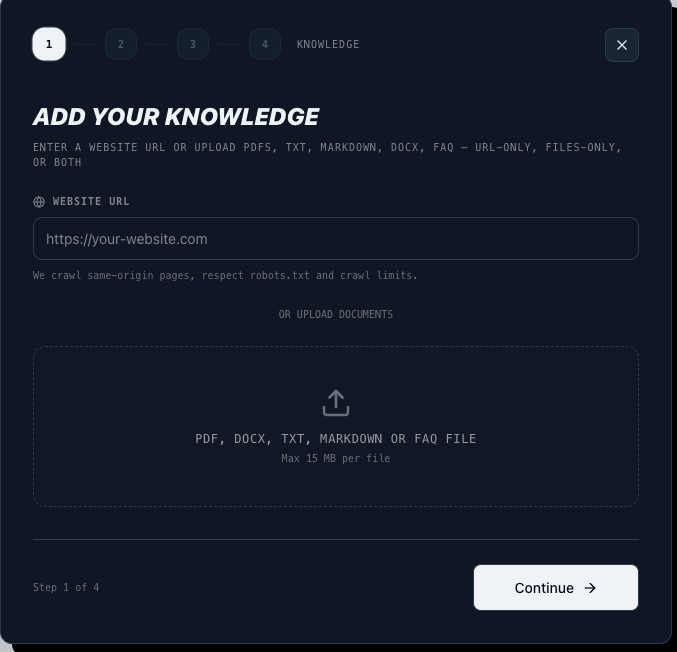
</td>
</tr>
<tr>
<td width="50%" valign="middle">

### 3. Configure Provider — Any OpenAI-Compatible API

Pick provider → Base URL auto-fills → paste API key → **Fetch models** lists live models (prioritizes `:free` for OpenRouter). Keys stored encrypted (AES-256-GCM), never in embed.

</td>
<td width="50%">
  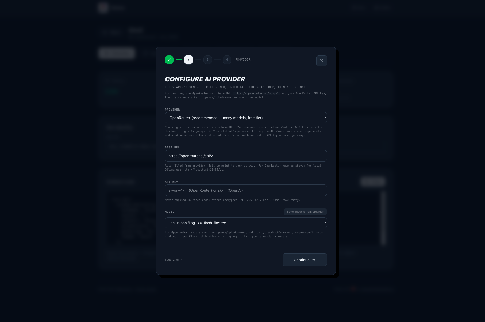
</td>
</tr>
<tr>
<td width="50%" valign="middle">

### 4. Embed — 2 Lines

Copy from **Overview → Embed code** or **Knowledge → Step 4**. Auto-configures origin via `window.location.origin`; widget loads via `chatbot-widget.js` with SSE streaming.

</td>
<td width="50%">
  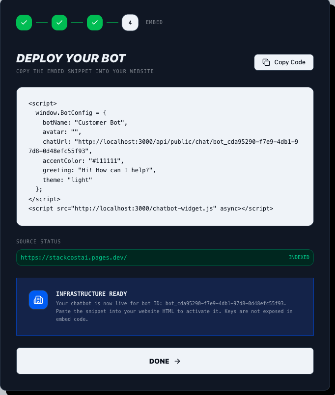
</td>
</tr>
</table>

---

## Requirements

| Requirement | Details |
|:------------|:--------|
| **OS** | macOS, Linux, Windows (WSL) |
| **Runtime** | Node.js 18+ |
| **Package Manager** | npm |
| **Python** | 3.10+ (crawler, optional but recommended) |
| **Python Deps** | `aiohttp`, `beautifulsoup4`, `lxml`, `requests`, `brotli` (+ `playwright` for JS-heavy sites) |

---

## Tech Stack

<p>
  <a href="https://reactjs.org/"></a>
  <a href="https://vitejs.dev/"></a>
  <a href="https://www.typescriptlang.org/"></a>
  <a href="https://tailwindcss.com/"></a>
  <a href="https://expressjs.com/"></a>
  <a href="https://github.com/WiseLibs/better-sqlite3"></a>
  <a href="https://www.python.org/"></a>
</p>

---

## Installation

```bash
# Clone
git clone https://github.com/AniketWathore/bolnee-chat.git
cd bolnee-chat

# Env
cp .env.example .env
# edit .env — simplest self-hosted:
# DISABLE_AUTH=true
# JWT_SECRET=change-me-32-chars
# LLM_BASE_URL=https://openrouter.ai/api/v1   # optional global fallback
# LLM_API_KEY=sk-or-v1-...                     # optional global fallback
# LLM_MODEL=inclusionai/ling-3.0-flash-fin:free

# Install
npm install

# Python crawler deps (optional)
pip install aiohttp beautifulsoup4 lxml requests brotli

# Verify
npm run lint    # tsc --noEmit
npm run build   # vite + esbuild → dist/
npm run dev     # http://localhost:3000 (auto-fallback to 3001 if busy)
```

SQLite is created at `data/bolnee.db` (git-ignored). Crawled sites → `data/{chatbotId}_website.json`, chunks in SQLite.

---

## Usage — Dashboard Flow

1. **Create chatbot** — `+ New chatbot` → name + avatar (preview ≤2MB).
2. **Add knowledge** — enter `https://your-site.com` and/or upload PDF/TXT/MD/DOCX/FAQ → status `queued → indexed`.
3. **Configure provider** — choose provider → `Fetch models` → pick model → Save. Keys encrypted, not in embed.
4. **Embed** — copy snippet from `Overview`:

```html
<script>
  window.BotConfig = {
    botName: "Customer Bot",
    avatar: "https://your-domain/api/public/avatar/BOT_ID",
    chatUrl: "https://your-domain/api/public/chat/BOT_ID",
    accentColor: "#111111",
    greeting: "Hi! How can I help?",
    theme: "dark"
  };
</script>
<script src="https://your-domain/chatbot-widget.js" async></script>
```

Paste before `</body>`. Widget stores `VISITOR_ID` + chat history in `localStorage`; greeting shows once.

---

## Bot Console Reference

| Tab | What it does |
|---|---|
| **Overview** | Live status, messages/users/sources, embed copy (`src/components/ChatbotDashboard.tsx:244`) |
| **Appearance** | `name/avatar/accent/theme/greeting` + live preview (`src/components/ChatbotDashboard.tsx:282`) |
| **Chats** | Grouped by visitor → date, `CSV/JSON/PDF`, `Refresh` (`src/components/ChatbotDashboard.tsx:371`) |
| **Knowledge** | Sources + `Add knowledge` wizard (`src/components/ChatbotDashboard.tsx:449`) |
| **Settings** | `provider/model/baseUrl/apiKey`, `defaultMessage/fallbackMessage`, `Danger zone` delete (`src/components/ChatbotDashboard.tsx:493`) |

---

## API Reference

| Method | Path | Description |
|---|---|---|
| `POST` | `/api/chatbots` | Create bot |
| `GET` | `/api/chatbots` | List bots |
| `PATCH` | `/api/chatbots/:id` | Appearance + provider (`name/avatar/accent/theme/greeting` + `provider/model/apiKey/baseUrl`) |
| `GET` | `/api/chatbots/:id/appearance` | Get appearance (`server.ts:728`) |
| `GET` | `/api/chatbots/:id/messages?limit=200` | Grouped messages |
| `GET` | `/api/chatbots/:id/stats` | `total/users` |
| `GET` | `/api/chatbots/:id/messages/export?format=csv\|json` | Export |
| `GET` | `/api/knowledge/sources?chatbotId=ID` | List sources |
| `POST` | `/api/knowledge/sources/:chatbotId` | Add URL (`{url}`) or file (`multipart`) → `queued` |
| `DELETE` | `/api/knowledge/sources/:sourceId?chatbotId=ID` | Delete source + chunks |
| `POST` | `/api/public/chat/:chatbotId` | SSE chat `{message, visitorId}` → `data: {token\|error\|sources}` + `data: [DONE]` |
| `GET` | `/api/public/knowledge/:chatbotId` | Public knowledge (cached) |
| `GET` | `/api/public/avatar/:chatbotId` | Avatar file or redirect |
| `POST` | `/api/providers/models` | List models for `provider/baseUrl/apiKey` |
| `GET` | `/api/stats` | Global `totalMessages/activeSessions` |

Streaming: `public/chatbot-widget.js:311` reads SSE via `getReader()`, falls back to `text()` + SW bypass for `locked` streams. Visitor grouping via `X-Visitor-Id` (`VISITOR_ID` in `localStorage`).

---

## File Reference

| Path | Role |
|---|---|
| `server.ts` | Express + Vite dev, auth (`DISABLE_AUTH`), ingestion, RAG, SSE chat (`server.ts:282`) |
| `server/db.ts` | SQLite (`better-sqlite3`) — `chatbots/sources/chunks/messages`, `getChatbotAppearance` |
| `server/ingestion.ts` + `crawler/run_crawler_for_bolnee.py` | Crawl → `/data/{id}_website.json` → chunks |
| `crawler/crawler.py` | Same-origin crawl, `robots.txt`, `h1/h2/p/li` extraction, sitemap + homepage |
| `public/chatbot-widget.js` | Embeddable widget — `BotConfig.chatUrl`, accent, greeting, theme, `VISITOR_ID`, history |
| `src/components/ChatbotDashboard.tsx` | Tabs: overview/appearance/chats/knowledge/settings, `embedCode` with `theme` |
| `src/components/KnowledgeSection.tsx` | 4-step wizard: Knowledge → Provider → Processing (polls status) → Embed |
| `src/components/Overview.tsx` | Stats + grid of 4 bots + `View all` |
| `src/components/BotCreationWizard.tsx` | Name + avatar upload (2MB limit) |
| `src/index.css` | Dark-mode tokens (`--color-bg #020617`, `--color-card #1e293b`) |
| `vercel.json` / `wrangler.toml` | Hosting rewrites, `bucket = "./dist"`, `DISABLE_AUTH` |

---

## Hosting

Dashboard is fully API-driven (`/api/*` relative) and auto-configures `window.location.origin` for embed URLs.

**Vercel:**
```bash
# env
DISABLE_AUTH=true
# JWT_SECRET not required for simple mode

# vercel.json already: rewrites /api/:path* → /api, /(.*) → /index.html, outputDirectory: dist
npm run build && vercel --prod
```

**Cloudflare Pages / Workers:**
```bash
# wrangler.toml: bucket = "./dist", DISABLE_AUTH=true
npm run build
wrangler pages deploy dist
# or: npx wrangler deploy
```

Chat endpoint streams SSE; for external sites use public `https://` `chatUrl` (not `localhost`).

---

## Configuration

| Env | Description | Default |
|---|---|---|
| `DISABLE_AUTH` / `VITE_DISABLE_AUTH` | No-login console (single-tenant) | `false` |
| `JWT_SECRET` | Auth signing key (16+ chars, prod required) | `development-secret-change-me` |
| `LLM_BASE_URL` / `OPENROUTER_API_KEY` / `NVIDIA_API_KEY` | Global provider fallback (per-bot settings take precedence) | — |
| `LLM_API_KEY` | Global API key fallback | — |
| `LLM_MODEL` | Global model fallback (e.g. `openai/gpt-4o-mini`) | `gpt-4o-mini` |
| `PORT` | Server port (auto-fallback `+1` if busy) | `3000` |

`.env.example` documents all.

---

## Troubleshooting

| Symptom | Fix |
|---|---|
| Port `3000 in use → 3001` and embed fails on external site | Embed uses `window.location.origin`; regenerate after restart or deploy to public URL (localhost embed is `https://` mixed-content) |
| `getReader locked` / `ReadableStream locked` | Bump `public/sw.js` to `v3` skips `POST /api/public/chat`; hard-refresh to update SW |
| Model `404` / `402` | Use **Fetch models** → pick `:free` (e.g. `inclusionai/ling-3.0-flash-fin:free`) or add credits |
| `404` knowledge/avatar | Ensure `data/bolnee.db` exists and bot `id` matches `data/{id}_website.json` |
| Avatar too large | PNG/JPG/WEBP ≤2MB; data URLs auto-converted to `/api/public/avatar/:id` |
| Greeting repeats on open/close | Fixed in `public/chatbot-widget.js:115` — `saveHistory/loadHistory` in `localStorage` + `engine=true` guard; clear `bolnee_msgs_*` to reset |

---

## Verification Checklist

```bash
npm run lint      # tsc --noEmit clean
npm run build     # vite + esbuild → dist/
npm run dev       # http://localhost:3000
# Manual:
# 1. Create bot → avatar preview → Save appearance → preview updates
# 2. Add knowledge: URL + PDF → status queued → indexed
# 3. Provider → Fetch models → pick :free → Save
# 4. Overview → Copy embed → paste in plain HTML → widget loads, greeting once, close/open keeps history, dark/light/auto themes correct
# 5. Chats → grouped by visitor → CSV/JSON/PDF export
# 6. Settings → default/fallback messages → Chat without sources returns fallback
```

---

## License

Distributed under the [MIT License](LICENSE). See [`LICENSE`](LICENSE) for more information.
